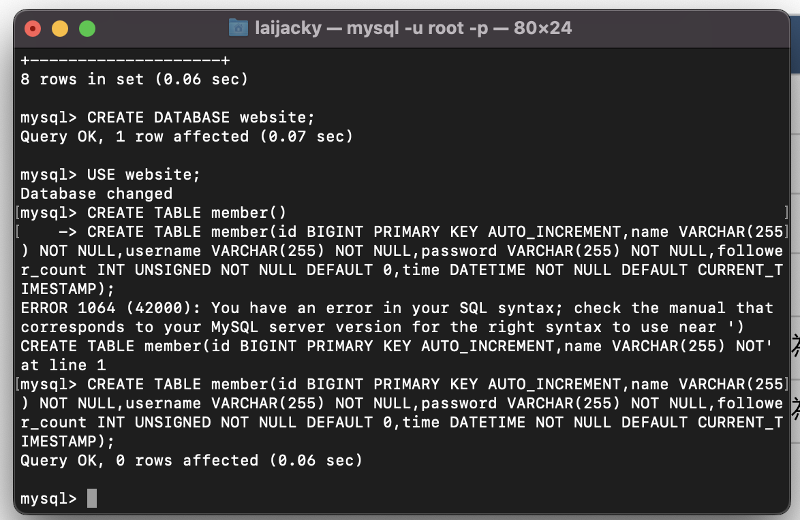
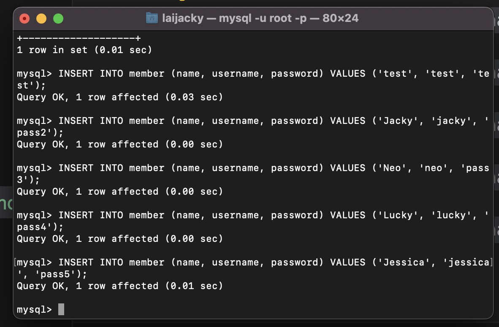
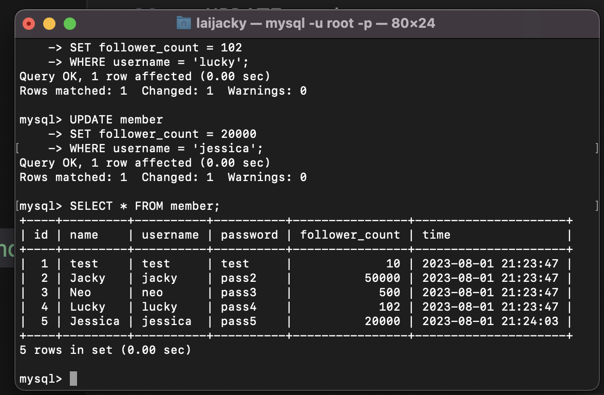
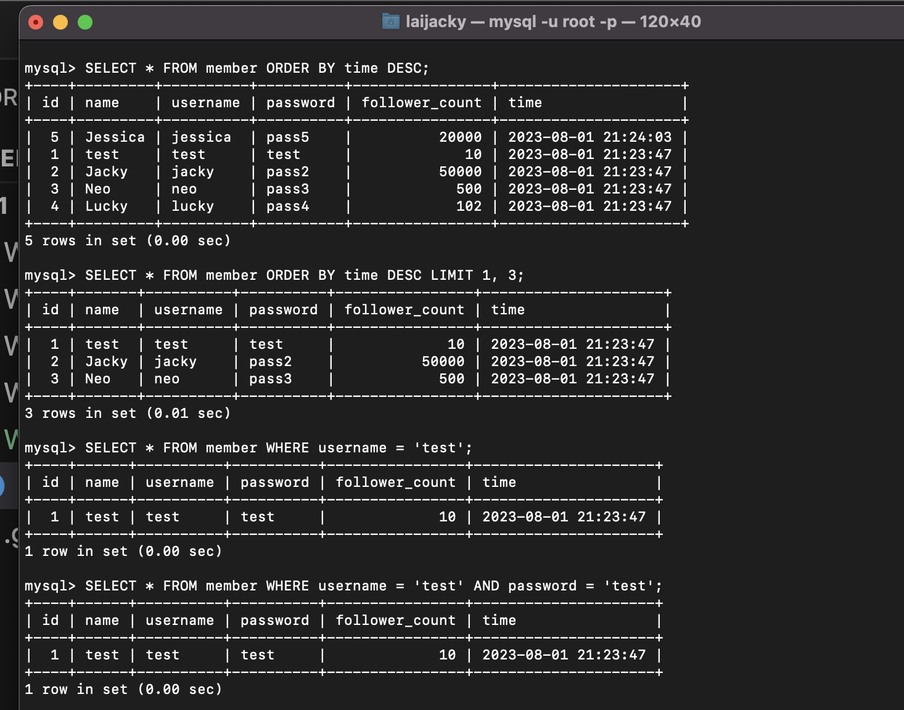
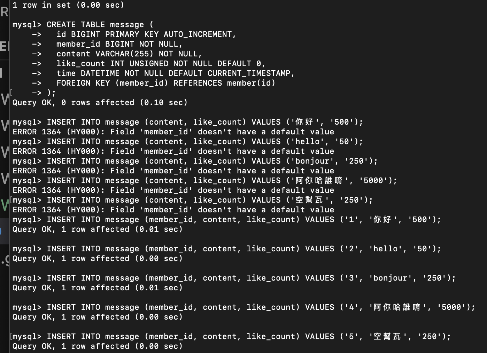
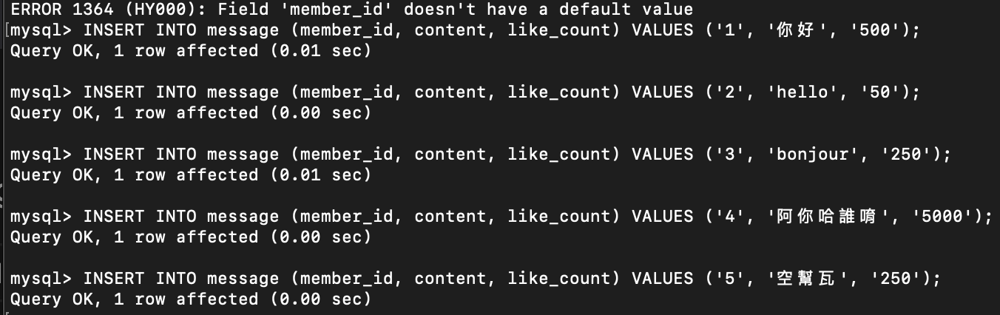
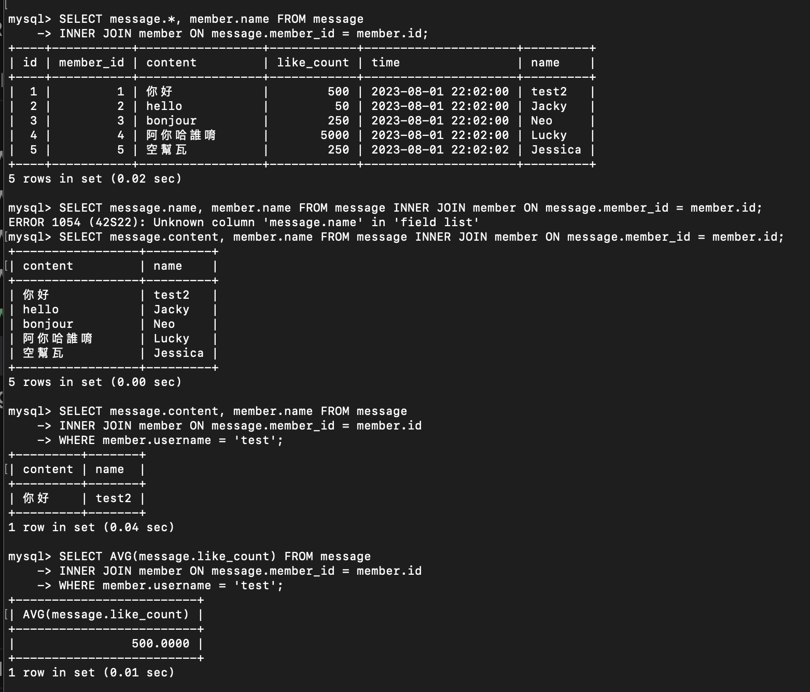

##以下為data.sql的指令
---
```
CREATE DATABASE website;
```
---
```
USE website;
```

---
```
CREATE TABLE member (
  id BIGINT PRIMARY KEY AUTO_INCREMENT,
  name VARCHAR(255) NOT NULL,
  username VARCHAR(255) NOT NULL,
  password VARCHAR(255) NOT NULL,
  follower_count INT UNSIGNED NOT NULL DEFAULT 0,
  time DATETIME NOT NULL DEFAULT CURRENT_TIMESTAMP
);
```
---

```
INSERT INTO member (name, username, password) VALUES ('test', 'test', 'test');
INSERT INTO member (name, username, password) VALUES ('Jacky', 'jacky', 'pass2');
INSERT INTO member (name, username, password) VALUES ('Neo', 'neo', 'pass3');
INSERT INTO member (name, username, password) VALUES ('Lucky', 'lucky', 'pass4');
INSERT INTO member (name, username, password) VALUES ('Jessica', 'jessica', 'pass5');
```
---
```
UPDATE member 
SET follower_count = 10 
WHERE username = 'test';
UPDATE member 
SET follower_count = 50000
WHERE username = 'jacky';
UPDATE member 
SET follower_count = 500
WHERE username = 'neo';
UPDATE member 
SET follower_count = 102 
WHERE username = 'lucky';
UPDATE member 
SET follower_count = 20000
WHERE username = 'jessica';
```
---

```
SELECT * FROM member;
```
---
```
SELECT * FROM member ORDER BY time DESC;
```

---
```
SELECT * FROM member ORDER BY time DESC LIMIT 1, 3;

SELECT * FROM member WHERE username = 'test';

SELECT * FROM member WHERE username = 'test' AND password = 'test';

UPDATE member SET name = 'test2' WHERE username = 'test';

SELECT COUNT(*) FROM member;

SELECT SUM(follower_count) FROM member;
```
---

```
CREATE TABLE message (
  id BIGINT PRIMARY KEY AUTO_INCREMENT,
  member_id BIGINT NOT NULL,
  content VARCHAR(255) NOT NULL,
  like_count INT UNSIGNED NOT NULL DEFAULT 0,
  time DATETIME NOT NULL DEFAULT CURRENT_TIMESTAMP,
  FOREIGN KEY (member_id) REFERENCES member(id)
);
```
---

```
INSERT INTO message (member_id, content, like_count) VALUES ('1', '你好', '500');
INSERT INTO message (member_id, content, like_count) VALUES ('2', 'hello', '50');
INSERT INTO message (member_id, content, like_count) VALUES ('3', 'bonjour', '250');
INSERT INTO message (member_id, content, like_count) VALUES ('4', '阿你哈誰唷', '5000');
INSERT INTO message (member_id, content, like_count) VALUES ('5', '空幫瓦', '250');
```
---

```
SELECT message.content, member.name FROM message
INNER JOIN member ON message.member_id = member.id;

SELECT message.content, member.name FROM message
INNER JOIN member ON message.member_id = member.id
WHERE member.username = 'test';

SELECT AVG(message.like_count) FROM message
INNER JOIN member ON message.member_id = member.id
WHERE member.username = 'test';
```


